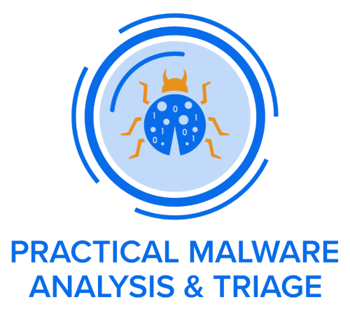
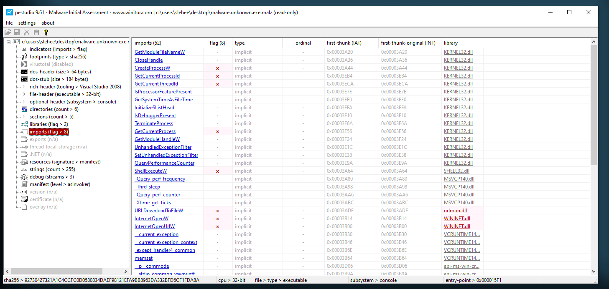

- Do not download these samples to a computer you do not own.
- Do not execute any of these samples on a computer you do not own.
- Do not download and/or execute these samples in an environment where you cannot revert to a saved state, i.e. a virtual machine.
- Practice safe malware handling procedures at all times when using these samples.


# Static Malware Analysis

Basic static analysis involves examining malware without executing it, using a variety of tools and techniques:

- **Hashing Malware Samples:** Generate unique identifiers for files to track and compare them.

    For example, on Linux you can use:
    ```bash
    sha256sum malware.exe
    md5sum malware.exe
    ```
    On Windows (PowerShell):
    ```powershell
    Get-FileHash malware.exe -Algorithm SHA256
    Get-FileHash malware.exe -Algorithm MD5
    ```


- **Malware Repositories (e.g., VirusTotal):** Submit and analyze samples using online databases for threat intelligence.
- **Strings & FLOSS:** Extract readable strings from binaries to uncover clues about functionality, commands, or embedded URLs.

!!! tip
    FLOSS can be run with the "-n" argument to specify your desired minimum string length. Sometimes, longer strings can be more useful to an analyst than your standard string of len(4).

    For example, to pull all strings of length 6 or greater:
    ```
    floss.exe -n 6 [malware_name.exe]
    ```


- **Import Address Table (IAT) Analysis:** Review imported functions to infer capabilities and behaviors.

    PEview is a lightweight Windows tool used to inspect the internal structure of PE (Portable Executable) files. It allows analysts to view headers, sections, and the Import Address Table, making it easier to identify which Windows API functions a binary imports and potentially uses during execution.


- **Windows API Introduction:** Understand how malware interacts with the operating system through API calls.
- **MalAPI.io:** Use online resources to look up Windows API functions and their security implications. ([malapi.io](https://malapi.io/))
- **Packed Malware Analysis:** Identify if a sample is packed or obfuscated, which can hide its true behavior.
- **Combining Methods (e.g., PEStudio):** Use multiple static analysis tools for a comprehensive overview.




- **MITRE ATT&CK Mapping:** Relate discovered capabilities to known adversary techniques for better context.

## Malware.Unknown.exe

| Analysis Step                | Details |
|-----------------------------|---------|
| **File Hash & VT Analysis**  | 92730427321a14ccfc0d0580834daef98121efa9bb8963da332bfd6cf1fda8a  (*Malware.Unknown.exe.malz*)<br>1d8562c0adcace734d63f7baaca02f7c  (*Malware.Unknown.exe.malz*)<br>VT Analysis: No results |
| **Strings & Floss Output**   | **FLOSS static Unicode strings:**<br>- jjjj<br>- cmd.exe /C ping 1.1.1.1 -n 1 -w 3000 > Nul & Del /f /q "%s"<br>- [http]://ssl-6582datamanager[.]helpdeskbros[.]local/favicon.ico<br>- C:\Users\Public\Documents\CR433101.dat.exe<br>- Mozilla/5.0<br>- [http]://huskyhacks[.]dev<br>- ping 1.1.1.1 -n 1 -w 3000 > Nul & C:\Users\Public\Documents\CR433101.dat.exe<br>- open |
| **IAT & PEView**             | **Window API Calls:**<br>- DownloadFromURL<br>- InternetOpenURLA<br>- ShellExec |

---

### About the Sample

The sample analyzed here, `Malware.Unknown.exe.malz`, is provided as part of the PMAT-labs at `labs/1-1.BasicStaticAnalysis/Malware.Unknown.exe.malz/Malware.Unknown.exe.7z`. Our goal during basic static analysis is to triage threats quickly and accurately by correlating static indicators.

### Introducing Capa

To further assist in this phase, we can use a tool called [Capa](https://github.com/mandiant/capa). Capa detects malicious capabilities in suspicious programs by matching technical indicators (like API calls or strings) against a set of high-level, human-readable rules. For example, Capa can identify if a binary is capable of "receiving data" or "connecting to a URL" by analyzing its features and matching them to rules.

- Capa comes with a default rule set and an open-source repository of community-contributed rules: [capa-rules](https://github.com/mandiant/capa-rules).
- To use Capa, run `capa -h` to see the usage menu and available options.
- Example usage: `capa Malware.Unknown.exe.malz`

Capa's output provides both technical details (like hashes) and high-level information, including mappings to MITRE ATT&CK tactics and techniques.

### What is MITRE ATT&CK?

[MITRE ATT&CK](https://attack.mitre.org/) is a widely adopted framework that classifies adversary tactics, techniques, and procedures (TTPs). It helps analysts understand and communicate about the types of actions adversaries take, such as gaining initial access (TA0001 - Initial Access) or executing code. The framework is an industry standard for threat intelligence and incident response.

## Malware Sample Sources

References:

- PMAT Labs: [https://github.com/HuskyHacks/PMAT-labs](https://github.com/HuskyHacks/PMAT-labs)
- theZoo: [https://github.com/ytisf/theZoo](https://github.com/ytisf/theZoo)
- vx-underground main site: [https://www.vx-underground.org/](https://www.vx-underground.org/)
- vx-underground GitHub repo: [https://github.com/vxunderground/MalwareSourceCode](https://github.com/vxunderground/MalwareSourceCode)
- Zeltser Resources: [https://zeltser.com/malware-sample-sources/](https://zeltser.com/malware-sample-sources/)
- MalwareBazaar: [https://bazaar.abuse.ch/](https://bazaar.abuse.ch/)
